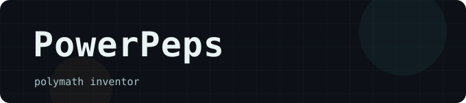

	<table>
		<tr>
			<td width="240" align="center" valign="top">
				<a href="https://github.com/PowerPeps/Alpenstock">
					
					 
					<b>Alpenstock</b>
				</a>
				  
				A collection of small, focused, generic directives for AlpineJS.
				 &nbsp;
			</td>
			<td width="240" align="center" valign="top">
				<a href="https://github.com/PowerPeps/Junct">
					
					 
					<b>Junct</b>
				</a>
				  
				Windows Explorer shell extension that makes folder sharing and mklink stupidly simple.
				 &nbsp;
			</td>
			<td width="240" align="center" valign="top">
				<a href="https://github.com/Caterpillar-Project/caterpillar-releases">
					
					 
					<b>Caterpillar</b>
				</a>
				  
				A fully procedural platformer where you play as a grappling-hook-wielding caterpillar.
				 &nbsp;
			</td>
		</tr>
		<tr>
			<td align="center" valign="bottom">
				
			</td>
			<td align="center" valign="bottom">
				
			</td>
			<td align="center" valign="bottom">
				
			</td>
		</tr>
	</table>

